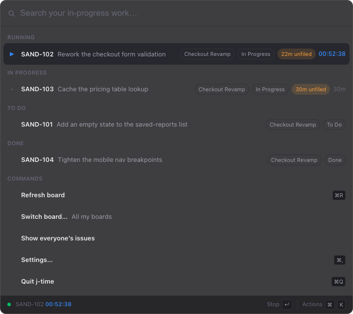

# j-time

A menu-bar launcher with a Raycast-style command palette. Press a hotkey and see
what you're in the middle of, then act on it without leaving the keyboard.

One plugin ships with it: **JIRA** — your board, with a timer. Put the clock on
a story and file the time against JIRA.

Each plugin gets its own section. You choose the order, collapse the ones you're
not using, and a section may lift one row above the rest — the running timer,
say.



## Download

Grab the latest `.dmg` from the [Releases page](https://github.com/rustybucket-cloud/j-time/releases)
— `arm64` for Apple silicon, `x64` for Intel. Open it and drag **j-time** to
Applications.

### The first launch

The build is unsigned — signing it needs a paid Apple Developer account — so
macOS blocks it once before it will ever run. What you'll see is a dialog saying
j-time "is damaged" or "cannot be opened because Apple cannot check it for
malicious software". Nothing is damaged; that's the wording for *no signature*.

**On macOS Sequoia (15) and later**, including Tahoe (26):

1. Double-click **j-time**. Dismiss the dialog it throws.
2. Open **System Settings → Privacy & Security** and scroll to the bottom. There's
   a line about j-time being blocked, with an **Open Anyway** button. Click it.
3. Confirm with Touch ID or your password, then **Open** in the last dialog.

Sequoia removed the old Control-click shortcut, so step 2 is not optional there.

**On Sonoma (14) and earlier**, the shorter dance still works: right-click (or
Control-click) the app in Applications, choose **Open**, then **Open** again in
the dialog that appears.

**Either version**, from a terminal, in one line:

```bash
xattr -dr com.apple.quarantine /Applications/j-time.app
```

That strips the quarantine flag macOS attaches to downloads, and the app opens
normally from then on.

You only do this once per install — but a new release is a new download, so
each upgrade asks again.

There's no window and no Dock icon — it lives in the menu bar. Press `⌘⇧J`.

## Build it yourself

```bash
npm install
npm run build
npm start
```

## Set up

The first launch opens straight to Settings. Each plugin is set up separately.

**JIRA** needs three things:

- your JIRA URL, e.g. `https://your-org.atlassian.net`
- the email on the account
- an API token from **id.atlassian.com → Security → API tokens**

Also there: the activity labels you file time under, and the rounding increment.
The token is stored encrypted with Electron's safeStorage.

The app's own settings — the hotkey, and the order of the plugins — are on the
same screen, reached with `⌘,`.

## Plugins

Each section of the palette is a plugin, and you can write your own. They live
in `~/.j-time/plugins`, one folder per plugin with a `main.js` inside — a plain
CommonJS module that returns rows as data and names the commands they can run.
The first launch puts an example (`bookmarks/`) there, next to an `AGENTS.md`
(and a `CLAUDE.md`, same text) that spells out the contract. **Copy path** on
the Settings screen puts the folder's location on the clipboard, and **Reload
plugins** in the palette picks up new folders and edits without a restart.

A plugin's file runs in the app's main process with Node and Electron available;
what it hands back is checked and drawn by the app, so a plugin never draws
anything and every section gets the same keys, search and pinning. JIRA and
Claude Code are compiled in rather than loaded from the folder — they have
screens and pickers the data-only contract doesn't cover.

## Use it

Press `⌘⇧J` for the palette. Sections appear in the order you arranged them,
with the running story pinned above them.

Typing sorts *within* each section and leaves the sections where they are — the
arrangement is the thing you set up, and dissolving it the moment you search
would make it useless exactly when you're looking for something. What typing
does instead is lift the single best match across everything into **Top hit**.

| Key | |
|---|---|
| `⌘⇧J` | Show or hide the palette |
| `↩` | Run the selected row — or collapse the section, on a heading |
| `⌘K` | Every action for the selected row |
| `←` / `→` | Collapse or expand the section |
| `⌘↑` / `⌘↓` | Move the section up or down |
| `⌘R` / `⌘,` | Refresh everything / Settings |
| `⌘Q` | Quit |
| `⎋` or `⌫` | Back one level, then close |

On a JIRA story:

| Key | |
|---|---|
| `↩` | Start or stop the clock |
| `⌘F` | File its unfiled time under an activity |
| `⌘D` | Finish it — sweep any unfiled time, then transition |
| `⌘I` | Clock, activity breakdown, estimate |
| `⌘O` / `⌘C` | Open in JIRA / copy the key |

The button at the bottom-left of the palette opens the app's own menu — Settings,
refresh and quitting. With no Dock icon and no application menu, that button and
the menu bar item are the only ways out that don't need a keystroke.

The menu bar ticks whenever the clock is running. Right-click it for stop, file
and refresh.

**Start** opens a segment. **Stop** closes it and leaves it unfiled. **Filing**
it under an activity posts a worklog to JIRA immediately, at the chunk's exact
length. **Finish** sweeps anything still unfiled, then moves the status.

Time is measured, never estimated — an idle window accrues nothing.

## Where your data lives

`~/.j-time/` — `config.json` and `state.json`, both written `0600`. Every
plugin's credentials are encrypted with your login keychain before they touch
disk. `config.json` holds a section per plugin; a config written by an earlier
version, when JIRA was the whole app, is migrated in place on first read.
